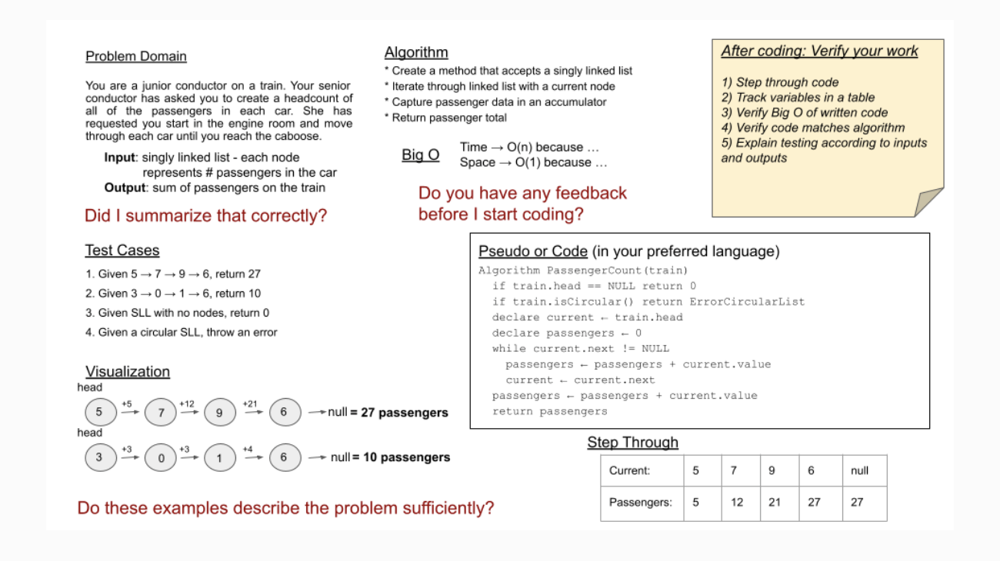

## Linked List
Utilize the Single-responsibility principle: any methods you write should be clean, reusable, abstract component parts to the whole challenge. You will be given feedback and marked down if you attempt to define a large, complex algorithm in one function definition.

## White Board

